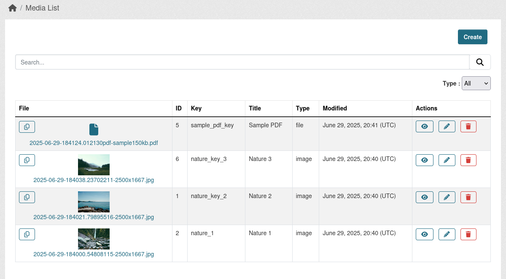

`ckanext-media` is a CKAN extension that provides a flexible and centralized system for managing various media files (such as images, documents, and custom file types) using CKAN's core logic. It is designed to be a reusable solution for handling media assets across different parts of a CKAN site.

