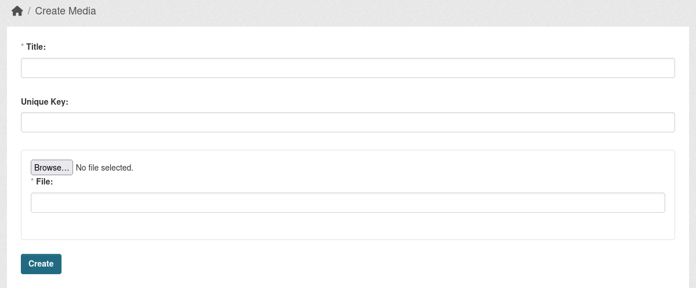

## Add Media item

Go to `/media/list` on your portal and click `Create` and choose Media type you want to Add.

Fill the three fields:

* Title - User friendly naming of future menu. 

* Key - (Recommended to fill) It used as an alternative to ID, but can stays consistent through environments while deploying. There no validators regarding in which form the Key should be set, but only checks that is doesn't already exist. Case sensetive.

* File - Upload the file you want to attach to the Media item.




## Attach Media in Jinja templates

You can retrieve the Media direct URL using the following helpers:

* `h.get_media_fileurl_by_id("1")` (Wouldn't recommend, as the ID can be different in different Environments)
* `h.get_media_fileurl_by_key("my_custom_key")` (Recommended)
* `h.get_media_fileurl_by_filename("FILEMANE")`. (Use if your Dataset or other entity stores the filename, rather then ID or Key)

If you need the actual Media object to have the Title additionally, use:

* `h.get_media_by_key("my_custom_key")`
* `h.find_media("value")` (More unique, but heavier call as you can pass either ID, Key or Filename and it will try to search through those item to find the Media)

Call examples:

```
Get URL
<a href="{{ h.get_media_fileurl_by_key("my_custom_key") }}">Link</a>


Get full Media Object


 <a href="{{ h.get_media_fileurl_by_filename(media.file) }}">{{ media.title }}</a>


Set background

<div class="my-custom-wrapper" style="background: url('{{ background }}')">
    <p>Test</p>
</div>
```

## Attach Media field to Dataset or other entities

This will work only if you are using Scheming or you'll need to modify the default schema using CKAN Hooks.

Field example:

```
- field_name: media_field_name
  label: Media field label
  form_snippet: media.html
  display_snippet: media.html
  media_button_text: Explore existing images
  validators: not_empty media_exists
  media_type: image
```

Field params:

* form_snippet - will display usual text input field and additionally attach Media Widget above, where you can search through Medias and while clicking, you it will paste into the field either ID, Key or Filename depending on what was clicked.
* display_snippet - display link to the File
* media_button_text - Widget button text
* validators - to be more specifc `media_exists` will check if the media exists or not using `h.find_media("value")`.
* media_type - type of Media you want to be attached, only 1 can be choosed.

You can write your own snippets for using media or rendering it depending on your needs.

## Additional Media types registration

There is an interface `IMedia` that has an method `media_types`, which provides you an ability to update/register new Media types.

Example of how it might look in your `plugin.py` file:

``` py
from ckanext.media.interfaces import IMedia

class MyPlugin(plugins.SingletonPlugin):
    plugins.implements(IMedia, inherit=True)

    def media_types(self, media_types):
        
        media_types['PROJECT_NAME_banner'] = { # Media type key, better use with prefix, as in future more Default type will be added and there won't be namespacing conflicts
            "label": "Banner", # Label for the Media type
            "allowed_mimetypes": ['image/png', 'image/gif', 'image/jpeg'], # Allowed mimetypes
            "max_filesize": 3, # Maximum filesize in MB, default 3
        }

        return media_types
```

## Extending Default Media types

Currently you can extend the mimietypes list for default Media types and the maximum filesize that is allowed (by default set to 3 MB).

You can find those settings on the [Config Settings](config_settings.md) page.
